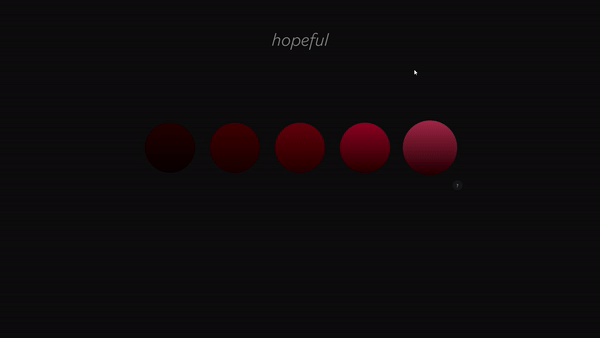
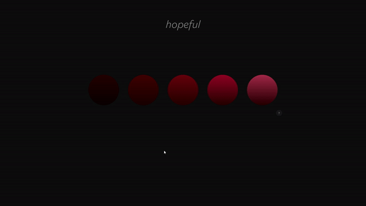

# Hopeful
> Hopeful is a project dedicated to the creation of soothing, modular soundscapes.  It was originally intended to be a music visualizer, but for various reasons we decided to descope and pivot to what we have here on a timeline of ~2 days.  We ended up with a cool little SPA with lots of room to expand and improve. I worked exclusively on the visual side of things while my classmate Benji engineered the sounds for the buttons.
## Table of Contents
* [Technologies Used](#technologies-used)
* [Features](#features)
* [Project Status](#project-status)
* [Acknowledgements](#acknowledgements)
* [Contact](#contact)

## Technologies Used
- React(Vite) HTML CSS for interactive, attractive aesthetics and animations.
- Web Audio API for client-generated sounds.

[Return to Table of Contents](#table-of-contents)

## Features
- Main page with buttons for sound and "Help" modal
- All elements have hover events

- When user sees this page full of buttons and is confused, they can click the help "?" button
- Modal slides up, displaying a short message about the purpose of the page and a hint to try clicking the circles
- User can dismiss the menu using "ok" button.

- Clickable circles have custom ripple animations, both on click and persisting until clicked again.

- Here's a short video demo so you can hear the sounds:
[Download Video](img/hopeful.mp4)

[Return to Table of Contents](#table-of-contents)

## Project Status
In Progress

[Return to Table of Contents](#table-of-contents)

## Acknowledgements
- Many thanks to [Benji Hix](https://github.com/benji-hix) for collaborating!

[Return to Table of Contents](#table-of-contents)

## Contact
[LINKEDIN](https://www.linkedin.com/in/joshua-bliek/)